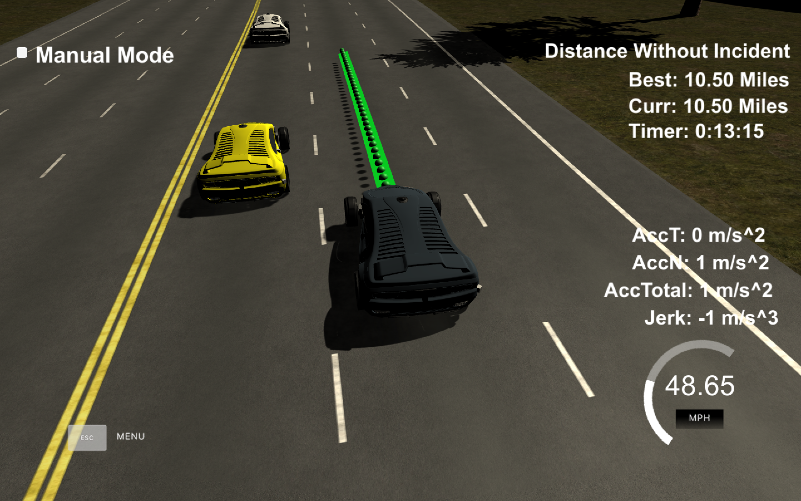

# Autonomous Car Path Planning Project
This project attempts to solve the [Udacity Path plannig problem](https://github.com/udacity/CarND-Path-Planning-Project).

## The project
It can be summarized as follows:
* Safely navigate around a virtual highway with other traffic
* +-10 MPH of the 50 MPH speed limit.
* Car's localization and sensor fusion data is provided by simulator
  * There is also a sparse list of waypoints around the highway.
* The car should try to go as close as possible to the 50 MPH speed limit, which means passing slower traffic when possible.
* The car should avoid hitting other cars at all cost as well as driving inside of the marked road lanes at all times.
* The highway is 6946m long. 
  * Since the car is trying to go 50 MPH, it should take a little over 5 minutes to complete 1 loop.
* Car should not experience total acceleration over 10 m/s^2 and jerk that is greater than 10 m/s^3.

### Notes

* The car uses a perfect controller and will visit every (x,y) point it recieves in the list every .02 seconds. The units for the (x,y) points are in meters and the spacing of the points determines the speed of the car. The vector going from a point to the next point in the list dictates the angle of the car. Acceleration both in the tangential and normal directions is measured along with the jerk, the rate of change of total Acceleration. The (x,y) point paths that the planner recieves should not have a total acceleration that goes over 10 m/s^2, also the jerk should not go over 50 m/s^3. (NOTE: As this is BETA, these requirements might change. Also currently jerk is over a .02 second interval, it would probably be better to average total acceleration over 1 second and measure jerk from that.

* There will be some latency between the simulator running and the path planner returning a path, with optimized code usually its not very long maybe just 1-3 time steps. During this delay the simulator will continue using points that it was last given, because of this its a good idea to store the last points you have used so you can have a smooth transition. previous_path_x, and previous_path_y can be helpful for this transition since they show the last points given to the simulator controller with the processed points already removed. You would either return a path that extends this previous path or make sure to create a new path that has a smooth transition with this last path.

## Data provided by simulator

### Main car's localization Data (No Noise)

* ["x"] The car's x position in map coordinates

* ["y"] The car's y position in map coordinates

* ["s"] The car's s position in frenet coordinates

* ["d"] The car's d position in frenet coordinates

* ["yaw"] The car's yaw angle in the map

* ["speed"] The car's speed in MPH

### Previous path data
* ["previous_path_x"] The previous list of x points previously given to the simulator
* ["previous_path_y"] The previous list of y points previously given to the simulator

### Previous path's end s and d values 

* ["end_path_s"] The previous list's last point's frenet s value

* ["end_path_d"] The previous list's last point's frenet d value

### Sensor Fusion Data (No Noise)

* ["sensor_fusion"] A 2d vector of cars and then that car's [car's unique ID, car's x position in map coordinates, car's y position in map coordinates, car's x velocity in m/s, car's y velocity in m/s, car's s position in frenet coordinates, car's d position in frenet coordinates. 

### Waypoint data
Each waypoint in the list contains [x,y,s,dx,dy] values.
* x and y are the waypoint's map coordinate position
* s value is the distance along the road to get to that waypoint in meters
* dx and dy values define the unit normal vector pointing outward of the highway loop.
* The highway's waypoints loop around so the frenet s value, distance along the road, goes from 0 to 6945.554.

## Basic Build Instructions
If you want, you can try this project on your own machine.

### Dependencies

* cmake >= 3.5
  * All OSes: [click here for installation instructions](https://cmake.org/install/)
* make >= 4.1
  * Linux: make is installed by default on most Linux distros
  * Mac: [install Xcode command line tools to get make](https://developer.apple.com/xcode/features/)
  * Windows: [Click here for installation instructions](http://gnuwin32.sourceforge.net/packages/make.htm)
* gcc/g++ >= 5.4
  * Linux: gcc / g++ is installed by default on most Linux distros
  * Mac: same deal as make - [install Xcode command line tools]((https://developer.apple.com/xcode/features/)
  * Windows: recommend using [MinGW](http://www.mingw.org/)
* [uWebSockets](https://github.com/uWebSockets/uWebSockets)
  * Run either `install-mac.sh` or `install-ubuntu.sh` depending on OS.

### Steps to build and run
1. Clone this repo.
2. Make a build directory: `mkdir build && cd build`
3. Compile using: `cmake .. && make`
4. Run it via: `./path_planning`.
5. Download and Run the `term3_sim` simulator from [here](https://github.com/udacity/self-driving-car-sim/releases/tag/T3_v1.2)

### Code Style

This project uses the [Google's C++ style guide](https://google.github.io/styleguide/cppguide.html).
